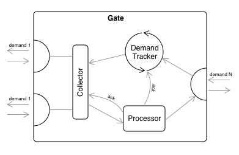

# XCombine


[](https://github.com/SergeBouts/XCombine/blob/master/LICENSE)

This repo contains XCombine, a Swift module, developed on top of the Combine framework to extend it and provide alternative implementations. The solutions were found while exploring Combine, and I believe could be interesting or useful to others as well.

## Table of Contents

- [Installation](#installation)
  - [Swift Package as Dependendcy in Xcode 11+](#swift-package-as-dependency-in-xcode-11)
  - [Manually](#manually)
- [Usage](#usage)
- [Zip Operator](#zip-operator)
  - [General Structure](#general-structure)
  - [Example of Usage](#example-of-usage)
- [ShareReplay Operator](#sharereplay-operator)
  - [Example of Usage](#example-of-usage-sharereplay)
- [WithLatestFrom Operator](#withlatestfrom-operator)
  - [Example of Usage](#example-of-usage-withlatestfrom)
- [License](#license)

## Installation

### Swift Package as Dependency in Xcode 11+

1. Go to "File" -> "Swift Packages" -> "Add Package Dependency"
2. Paste XCombine's repository URL into the search field:

`https://github.com/SergeBouts/XCombine.git`

3. Click "Next"
4. Ensure that the "Rules" field is set as this: "Branch: master"
5. Click "Next" to finish

For more info, check out [here](https://developer.apple.com/documentation/xcode/adding_package_dependencies_to_your_app).

### Manually

Simply Copy and Paste `Source/XCombine` files in your Xcode Project.

## Usage

Make sure the XCombine module is imported (as well as the Combine framework itself).

```swift
import Combine
import XCombine
```

XCombine facilities are available under an umbrella of the `x` property, which gets retroactively added to Combine's `Publisher`. For this reason, getting to XCombine operators is just as easy as to those of Combine itself, except you just need to specify `.x` in front. The following example illustrates the use of both Combine's and XCombine's `zip` operators.

```swift
let subject1 = PassthroughSubject<Int, Never>()
let subject2 = PassthroughSubject<Int, Never>()
let subject3 = PassthroughSubject<Int, Never>()

subject1
    .zip(subject2)  // Combine's zip
    .x.zip(subject3)  // XCombine's zip
    .sink(receiveValue: { _ in })
```

Both of them can freely appear within the same pipeline.

## Zip Operator

XCombine offers an alternative implementation of the `zip` operator to be used with the Combine framework, which has the advantages over the Combine's original one. It was designed to have the same documented functionality of the original one but is different at how it handles backpressure, in that the original `zip` operator just forwards the downstream's received demand upstream, while this one requests values by 1. By acting so it prevents some problematic usage scenarios, like those with the unbounded-size upstream sequences. For more information check out the discussion [here][combine-insight-into-zip-operator].

### General Structure

The provided `zip` operator is implemented in the form of a few cooperating sub-components as per the diagram below.

<p align="center">

</p>

*Gate* is a container object, that hosts the sub-components and represents the downstream subscription. An individual instance of *Gate* is created for each new subscriber (providing a new identity for each downstream subscriber). Each of the sub-components has its own role:

* *Demand Tracker* keeps track of received demand from the downstream and provides the basis of the `zip` operator's back pressure-driven logic. 

* *Collector* is responsible for different communication scenarios with the upstream publishers.

* *Processor* is responsible for the finalization of demand processing iterations.

### Example of Usage

As already mentioned, the use of XCombine's `zip` operator is no different from that of Combine's original one. To make things more interesting, an example of a usage scenario where the original `zip` operator [fails][combine-insight-into-zip-operator] while XCombine's one succeeds is given below. In it, arbitrary `events` are enumerated (indexed) using unbounded-size sequence `numbers`.

```swift
let events = PassthroughSubject<String, Never>()
let numbers = (0...).publisher  // unbounded-size sequence
let subscriber = events
    .x.zip(numbers)
    .sink(receiveValue: { pair in
        print("Received value \"\(pair.0)\" with index \(pair.1)")
    })
events.send("foo")
events.send("bar")
```

## ShareReplay Operator

XCombine offers the `shareReplay` operator that is not yet present in the Combine framework. It returns a publisher that shares a single subscription to the upstream. It also buffers a given number of latest incoming stream values and immediately upon subscription replays them. XCombine's `shareReplay`  operator features:

* autoconnect (reference counting) mechanism

* a circular buffer for caching-related optimization

* a fine grained back pressure handling

### <a name="example-of-usage-sharereplay"></a>Example of Usage

The following snippet is the updated example from the [blog post][combine-sharereplay-operator] on developing your own `shareReplay` operator. It demonstrates the use of XCombine's `shareReplay` operator.

```swift
import Combine
import XCombine

let measurements = PassthroughSubject<Int, Never>()

let diagramDataSource = measurements
    .share(replay: 3)

let subscriber1 = diagramDataSource
    .sink(
        receiveCompletion: { completion in
            print("Subscriber 1:", completion)
        },
        receiveValue: { temperature in
            print("Subscriber 1:", temperature)
        }
    )

measurements.send(100)
measurements.send(110)
```

## WithLatestFrom Operator

Another extension of the Combine framework that XCombine offers is the `withLatestFrom` operator which merges two publishers into one publisher by combining each element from self with the latest element from the second source. It returns a publisher that emits pairs of elements from the upstream publishers as tuples.

### <a name="example-of-usage-withlatestfrom"></a>Example of Usage

The following example demonstrates the use of the XCombine's `withLatestFrom` operator.

```swift
import Combine
import XCombine

let up1 = PassthroughSubject<Int, Never>()
let up2 = PassthroughSubject<String, Never>()

var subscriber = up1.x.withLatestFrom(up2)
    .sink(
        receiveCompletion: { completion in
            print(completion)
        },
        receiveValue: { v1, v2 in
            print(v1, v2)
    })

up1.send(1)
up2.send("foo")
up1.send(2)
up1.send(3)
up2.send("bar")
up2.send("baz")
up1.send(4)

// The console output:
// 2 foo
// 3 foo
// 4 baz
```

## License

This project is licensed under the MIT license.

[combine-insight-into-zip-operator]: https://sergebouts.github.io/combine-insight-into-zip-operator/
[combine-sharereplay-operator]: https://sergebouts.github.io/combine-sharereplay-operator/
